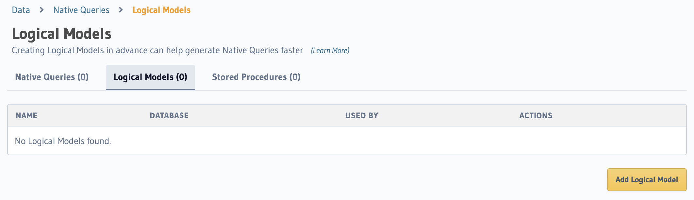
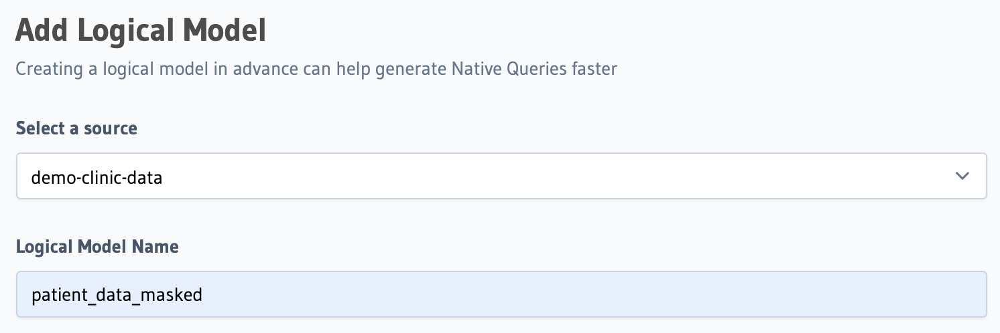
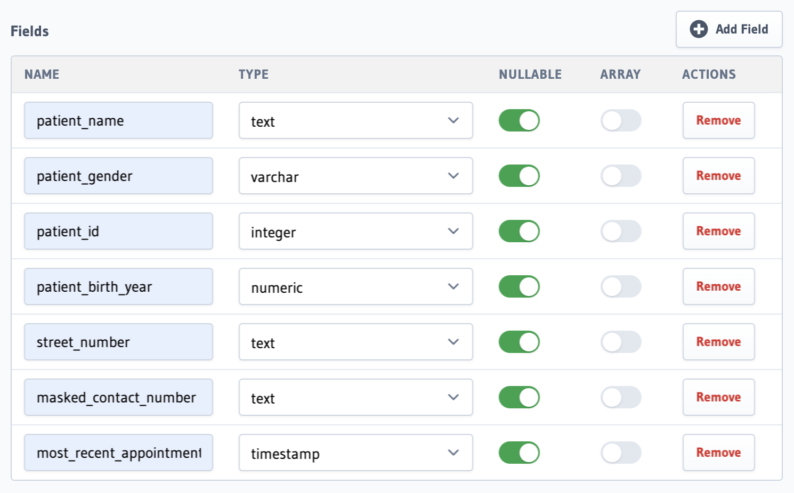

# Logical Models
Logical Models are a GraphQL representation of database data. They provide an abstraction over the underlying database in a simlar way to using a View on your database. The logic model will define the data types that you will be working with in this data masking function.
```bash,run
docker-compose up -d && hasura metadata apply
```

Step 1 - Add our logical model
=========
Let's begin by defining the data types. Head over to the Hasura console.

Data tab --> Native Queries --> Logical Models.


Add a new logical model, selecting the demo clinic database as the source. Let's name this model `patient_masked_data`.


Now we will define the data types we plan to return from our data masking function that we haven't yet created. This will help us think about the data model before we build the functionality. Add the fields as follows and create the model.


Step 2 - Create our data masking function
=========

# Native Queries
Now we get to the fun part, native queries allow us to leverage the underlying functionality of the database language -- in this case Postgres SQL. Let's write a SQL function that will return patient data but mask several pieces of private information.


🏁 Finish
=========

## Check

To complete this track, press **Check**
