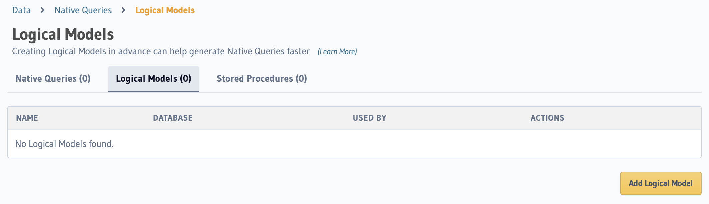

# Logical Models
Logical Models are a GraphQL representation of database data. They provide an abstraction over the underlying database in a simlar way to using a View on your database. The logic model will define the data types that you will be working with in this data masking function.

Step 1 - Add our logical model
=========
Let's begin by defining the data types. Head over to the Hasura console.

Data tab --> Native Queries --> Logical Models.

Add a new logical model

Step 2 - Create our data masking function
=========

🏁 Finish
=========

## Check

To complete this track, press **Check**
